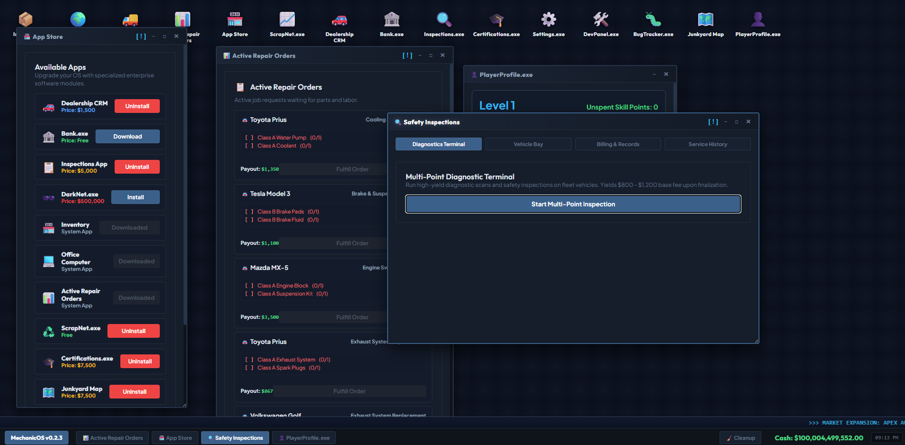
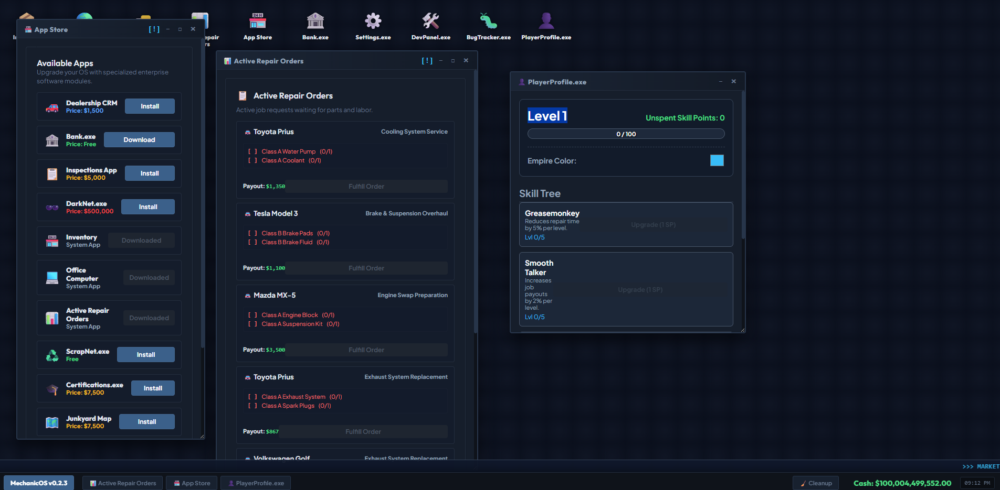
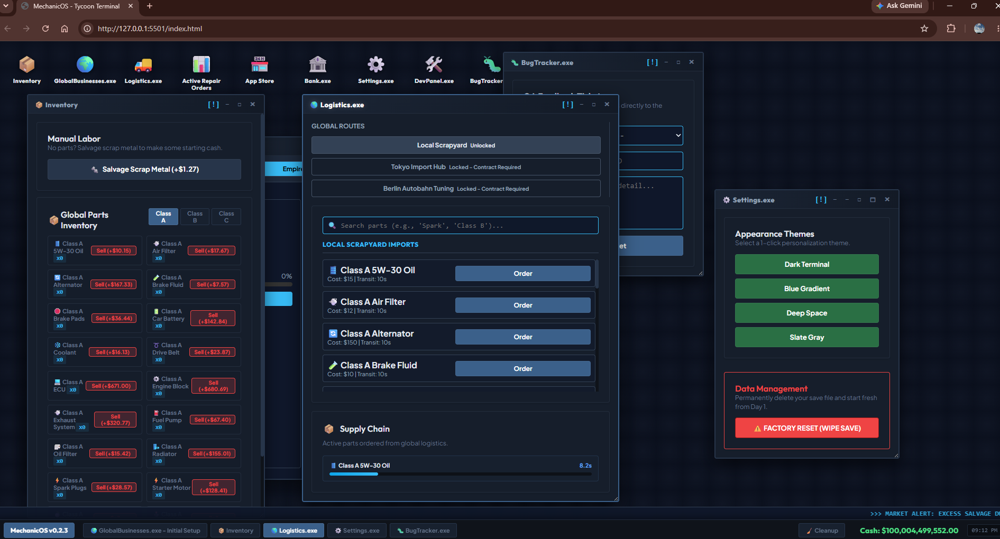
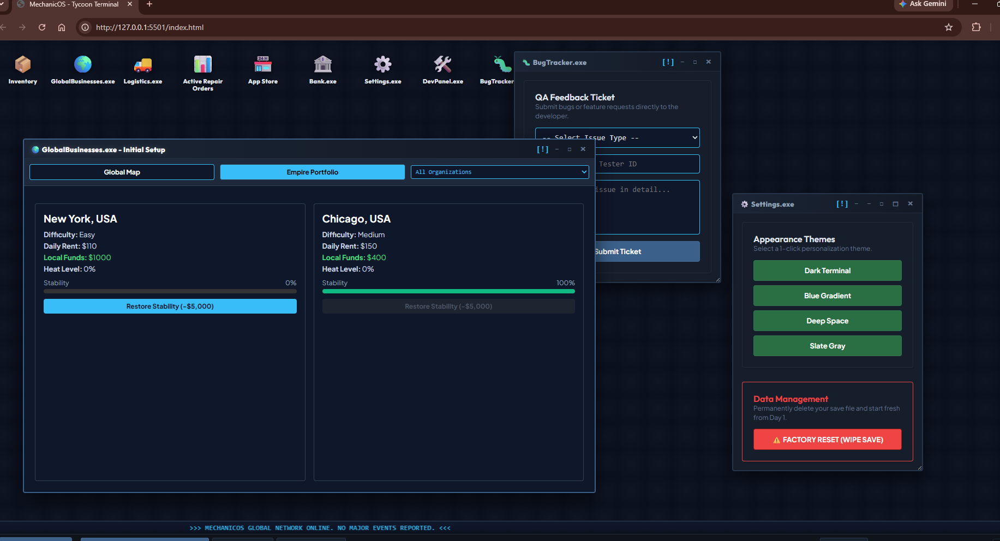
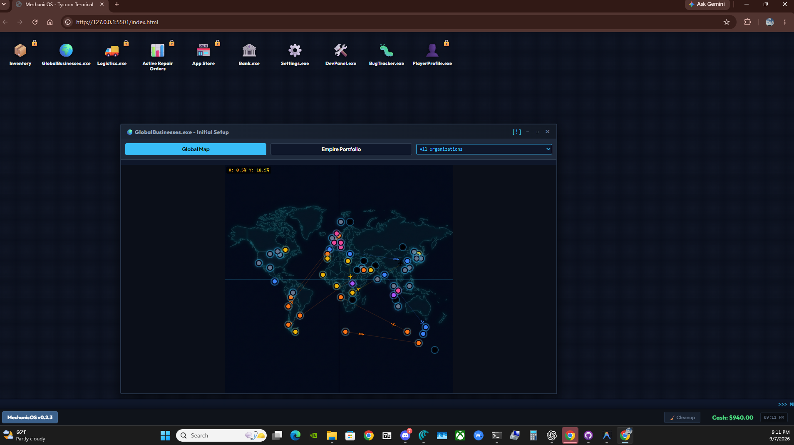
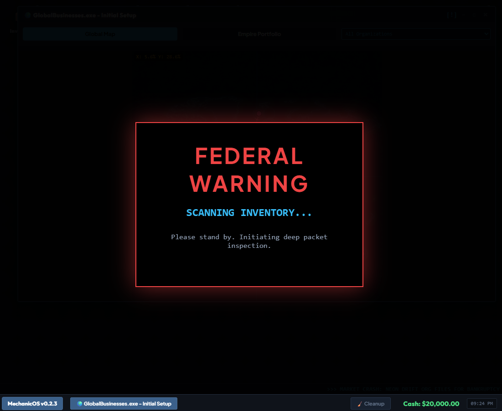

<div align="center">

# CarMechanicOS

### Mechanic Tycoon // Build, repair, expand, survive

<p>A desktop operating-system simulation where one garage becomes a global automotive empire.</p>


</div>

<br>


> **Public portfolio snapshot:** This repository was created from a sanitized release snapshot. Private development history, local runtime state, and credentials are intentionally not included.

## Product showcase

CarMechanicOS combines the immediacy of a repair shop with the strategic pressure of a global business simulator. Every decision changes cash, inventory, territory, stability, customer patience, or FBI heat.

| Surface | What it does |
|---|---|
| **Desktop OS** | Opens the game as a living collection of business applications, tools, alerts, and taskbar systems. |
| **GlobalBusinesses.exe** | Purchases locations, tracks rival factions, manages stability, and visualizes the world empire. |
| **Dealership CRM** | Turns procedural customer repair orders into a queue of jobs, parts, payouts, and deadlines. |
| **Inventory / Logistics** | Manages 36+ automotive parts, class restrictions, routes, shipping delays, and market prices. |
| **PlayerProfile.exe** | Tracks XP, levels, skill points, certifications, and specialist perks. |
| **Certifications.exe** | Licenses a delivery workforce; certification level controls which worker skills and shipment permissions are available. |
| **DarkNet.exe** | Adds high-risk heists, contraband, FBI heat, raids, and temporary lockouts. |

## The game loop

```text
Open an app → Accept a job → Source parts → Repair the vehicle → Get paid
      ↑                                                      ↓
      └──── daily simulation: rent • markets • factions • heat • raids ────┘
```

## Architecture

The project is intentionally lightweight and framework-free.

```text
index.html
├── Desktop shell and window manager
├── Application windows and modals
└── Map, CRM, inventory, logistics, profile, and DarkNet surfaces

style.css
├── Charcoal / slate design system
├── Responsive desktop layout
└── Map, taskbar, cards, alerts, and interaction states

game.js
├── Game state and save/load serialization
├── Repair orders, inventory, market, and logistics engines
├── Faction simulation, locations, routes, and FBI heat
└── UI event bindings and live updates
```

## Connected toolchain

CarMechanicOS is built as a browser-first simulation with a small, replaceable persistence boundary:

| Tool / service | Role | Connection status |
|---|---|---|
| **HTML, CSS, JavaScript** | Desktop shell, game UI, simulation state, and interactions | Active in the repository |
| **Node.js static server** | Serves the game locally on port `5501` | Active via the Windows launcher scripts |
| **Cloudflare Tunnel** | Publishes the local server through `https://carmechanicos.com` | Connected; routes to `127.0.0.1:5501` |
| **Supabase** | Optional authenticated cloud persistence for `player_saves` | Adapter and `auth.uid()`-scoped schema prepared; explicit token configuration required |
| **Atlas** | Future operations/memory layer for project status, routines, and telemetry | Separate service boundary; no game credentials are copied into Atlas |
| **Git / GitHub** | Source control, documentation, and public release snapshot | Repository: `ashimcode/carmechanicos-public` |

### Data flow

```text
Browser game
   │
   ├── localStorage fallback (always available locally)
   │
   └── optional backend.js adapter
          │  HTTPS REST with public Supabase key
          ▼
      Supabase project
          │
          └── public.player_saves
```

The browser never receives a database password or service-role key. The local `backend-config.js` file is ignored by Git. Before enabling cloud saves, run [docs/supabase-schema.sql](docs/supabase-schema.sql) in the Supabase SQL editor, then configure the browser-safe Publishable/anon key, an authenticated access token, and the matching `auth.uid()` player id. The adapter is disabled by default and will not use the former anonymous open-policy mode.

### Local development commands

```text
start-server.bat       Start the local game server
open-live-server.bat   Start the server, tunnel, and live URL
restart-server.bat     Restart local services
stop-server.bat        Stop local services
```

The cloud-save adapter is intentionally optional: gameplay remains functional when Supabase is unavailable, while the same save interface can later be connected to authenticated player accounts.

## Strategic systems

### Global empire

Acquire business licenses across North America, South America, Europe, Africa, Asia, and Oceania. Each location has its own cost, rent, available vehicle classes, bonuses, owner, stability, and heat.

### Repair economy

Customer orders create the operating rhythm of the game. Parts are consumed, patience falls over time, staff can automate repairs, and payouts scale with job difficulty and player skills.

### Risk economy

Contraband and DarkNet actions can accelerate growth, but every shortcut increases global heat. Raids can seize properties and temporarily lock down illegal operations.

### Certified delivery workforce

Certifications.exe turns progression into operations management. The **Logistics License** unlocks the first delivery worker and automated dispatch. **Route Optimization** unlocks worker speed upgrades, **Fleet Management** unlocks capacity upgrades and a second worker, and **Hazmat Endorsement** unlocks reliability upgrades that reduce high-risk route exposure. Shipment capacity, speed, and reliability are applied directly to the logistics simulation.

The Active Repair Orders app also includes an **Operations Contracts** board. Complete objectives such as fulfilling repairs, stocking the parts counter, opening a second location, hiring certified dispatch, and protecting high-risk operations to claim cash and XP rewards. Completed contracts persist in the local save and announce themselves through the AutoWire news ticker.

### Leveling and certifications

Repairs, contracts, and other business actions award XP. Each level grants one skill point for Greasemonkey, Smooth Talker, Ghost, or Second Chance. PlayerProfile.exe now shows the current rank and the next progression milestone, while Certifications.exe turns level milestones into purchasable operating licenses for the delivery workforce.

## Map correction

The map asset is a square canvas. The original layout stretched it into the wide application window, distorting country outlines and making city markers appear offset. The map wrapper now preserves a 1:1 aspect ratio and remains constrained to the available panel.

## Build journal

The detailed development narrative lives in [docs/BUILD-LOG.md](docs/BUILD-LOG.md), including the transition from OS simulation to empire systems, risk mechanics, the map correction, and the planned 3D evolution.

For an interviewer-friendly explanation of the architecture, hardening decisions, verification, and current limitations, see [docs/INTERVIEW_WALKTHROUGH.md](docs/INTERVIEW_WALKTHROUGH.md).

For assistant continuity, see [docs/OPENCLAW_PROJECT_CONTEXT.md](docs/OPENCLAW_PROJECT_CONTEXT.md). It is the canonical handoff record for OpenClaw/Atlas and future development sessions.

## Screenshot gallery

The visual language is a slate-and-charcoal enterprise terminal: crisp typography, luminous status colors, floating windows, live notifications, and dense but readable operational panels.

<table>
  <tr>
    <td width="50%"></td>
    <td width="50%"></td>
  </tr>
  <tr>
    <td><b>Operations desktop</b><br>Install business tools, manage active work, inspect vehicles, and track player progression.</td>
    <td><b>Repair economy</b><br>Customer orders, required parts, payouts, XP, and skill upgrades live in one operating surface.</td>
  </tr>
  <tr>
    <td width="50%"></td>
    <td width="50%"></td>
  </tr>
  <tr>
    <td><b>Supply chain</b><br>Search, order, and track global parts while market events alter the economy.</td>
    <td><b>Empire management</b><br>Review owned locations, stability, rent, heat, and operational tooling.</td>
  </tr>
  <tr>
    <td colspan="2"></td>
  </tr>
  <tr>
    <td colspan="2"><b>Global operations map</b><br>City ownership, faction territory, supply routes, and expansion decisions form the strategic layer.</td>
  </tr>
  <tr>
    <td colspan="2"></td>
  </tr>
  <tr>
    <td colspan="2"><b>Federal inventory scan</b><br>High-heat gameplay creates dramatic inspection events that interrupt normal operations and make illegal expansion feel dangerous.</td>
  </tr>
</table>

## Roadmap

- [x] Desktop OS window manager
- [x] Procedural repair-order pipeline
- [x] Parts inventory and global logistics
- [x] Faction territories and global map
- [x] XP, skills, and certifications
- [x] DarkNet operations and FBI heat
- [x] Aspect-ratio-safe map rendering
- [ ] Junkyard salvage timing/grid minigame
- [ ] Auction house and vehicle flipping
- [ ] 3D garage prototype
- [ ] First-person repair interactions
- [ ] Explorable junkyard, dealership, and city spaces

## Issues and verification queue

### Resolved

- [x] Neutral map locations incorrectly drained player cash during daily simulation — fixed in commit `4c5dfe8`; rent now applies only to owned or AI-controlled businesses.
- [x] App Store could inherit blanket-unlocked paid apps from older saves — fixed with an app ownership ledger and legacy-save migration; paid apps now require their listed purchase price.
- [x] Factory Reset could leave optional cloud saves available — reset now clears localStorage and the current player’s Supabase save before reloading.
- [x] Unaffordable purchases were silent or simply disabled — purchase attempts now shake the screen, show a red outline, and explain the required balance.
- [x] App Store insufficient-funds feedback is localized to the App Store window instead of shaking the whole desktop.
- [x] Garage operations now track reputation, customer satisfaction, worker morale/payroll, business upgrades, and timed events.
- [x] Certifications.exe opened as a missing executable — fixed with the real app window, desktop registration, and cache-busted assets.
- [x] Global map proportions stretched overlay markers — fixed with a square aspect-ratio wrapper.
- [x] Hard-coded Discord BugTracker webhook — removed from the browser bundle; reports now require a protected same-origin or HTTPS proxy.
- [x] Local static server exposed repository/configuration paths — added sensitive-path blocking, method restrictions, malformed-URL handling, and browser security headers.
- [x] Supabase prototype policy allowed anonymous cross-player save access — replaced with authenticated `auth.uid()` row-level security and explicit adapter opt-in.

### Open

- [ ] Playtest a fresh factory reset and a saved reload after the leveling/certification changes.
- [ ] Add automated browser smoke tests for App Store installation, business purchase, and daily simulation accounting.
- [ ] Finish the Junkyard salvage timing/grid experience and connect its rewards to progression.
- [ ] Prototype the first 3D garage scene while keeping the existing simulation state authoritative.
- [x] Revoke the historical Discord webhook found in older development history; BugTracker remains disabled until a protected proxy is configured.
- [ ] Add an account/authentication flow before enabling Supabase cloud saves for multiple players.

When reporting a new issue, include the build number, app name, steps to reproduce, expected behavior, actual behavior, and a screenshot when possible. BugTracker.exe can submit runtime diagnostics, including heat and inventory state.

## 3D direction

The current simulation can become a 3D mechanic-tycoon game without throwing away its strongest systems. The recommended migration is to keep `game.js` as the simulation source of truth while adding a 3D presentation layer in stages:

1. Build one polished explorable garage.
2. Add a first-person camera and interactable workstations.
3. Turn repair orders into physical repair tasks and customer handoffs.
4. Add vehicles, NPCs, junkyards, dealerships, and delivery routes.
5. Connect the 3D spaces to the existing global empire layer.

A browser-first prototype can use Three.js or Babylon.js. A larger standalone release could later move the same simulation concepts to Unity or Unreal.

## Run locally

Open `index.html` through a local static server. For the easiest workflow, double-click `open-live-server.bat`; it starts the local server on port `5501`, starts the Cloudflare Tunnel, and opens `https://carmechanicos.com` in your browser. The repository also includes Windows helpers:

```text
start-server.bat
open-live-server.bat
restart-server.bat
stop-server.bat
```

For a live preview, refresh the browser after source changes. A deployed host must also rebuild or redeploy before its public copy changes.

## Supabase and Cloudflare notes

Supabase is now supported as an optional authenticated cloud-save backend for persistent player state. The browser-first game continues to use localStorage when it is not configured. For the configured project, open [Supabase API Keys](https://supabase.com/dashboard/project/ctzrhxhzxmeuodnxrluu/settings/api-keys), copy the browser-safe **Publishable key** (or legacy **anon public** key), obtain an authenticated user access token from the Supabase Auth session, and place those values in a local `backend-config.js` copied from `backend-config.example.js`. Set `enabled: true` only after the player id matches `auth.uid()`, then run `docs/supabase-schema.sql` in the Supabase SQL editor. Never use a secret or service-role key in the browser.

The adapter writes the current save snapshot to `player_saves` with a debounced upsert and an eight-second timeout. The schema restricts reads, writes, and deletes to the authenticated owner. The game does not yet include a login screen, so cloud saves remain disabled unless an external Auth session supplies the access token.

Cloudflare is already connected as the public edge for `carmechanicos.com`. Its tunnel routes the hostname to `127.0.0.1:5501`, which is why the local launcher starts a server on that exact port before opening the site. Keep credentials and tunnel tokens outside Git. Supabase stores player state; Cloudflare provides the public HTTPS edge; neither service receives private keys from the frontend.

### Security and redaction

Before every push, verify that the repository contains no Supabase service-role key, Cloudflare tunnel token, API token, password, private key, database dump, browser state, or personal account information. The browser-safe Supabase publishable/anon key may be used only with authenticated, strict Row Level Security; never substitute a secret or service-role key. Keep `backend-config.js`, `.env*` files, tunnel logs, local databases, keys, and runtime logs untracked. BugTracker requires a protected same-origin or HTTPS proxy and must never receive a Discord webhook URL in the browser. Treat dashboard screenshots and support diagnostics as potentially sensitive and redact project identifiers, email addresses, tokens, and host details before publishing. See [SECURITY.md](SECURITY.md) for the complete policy and validation commands.

Atlas can provide a seamless dashboard for this project by tracking the repository, latest commit, live URL, Cloudflare health, and future Supabase migrations. That requires an Atlas-side connector or read-only status integration; it should not copy secrets into the dashboard.

## License and asset rights

This repository is a sanitized public portfolio snapshot. It does not currently grant broad source-code or asset reuse rights. Review the [asset and license record](docs/ASSET_RIGHTS_REVIEW.md) before redistributing the code, screenshots, map, video, fonts, or externally hosted visual assets. A future license decision must distinguish code ownership from third-party asset terms.
