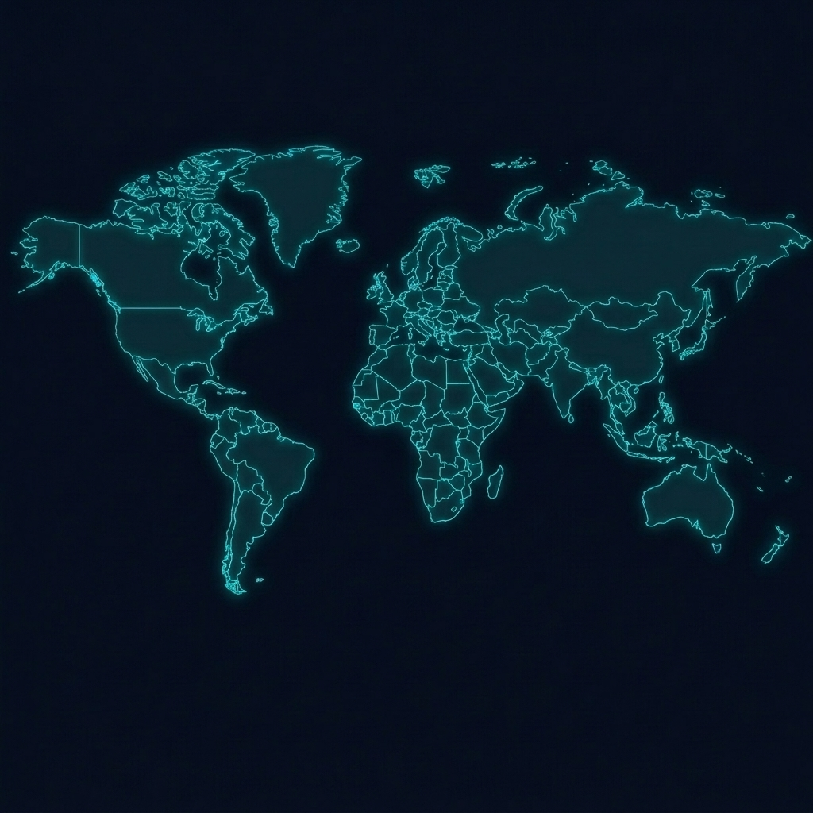

# CarMechanicOS — Build Journal & Technical Guide

> A visual field guide to the systems, decisions, and evolution of **CarMechanicOS / Mechanic Tycoon**.



## What this project is

CarMechanicOS is a browser-based mechanic-empire tycoon game presented as a dark enterprise operating system. The player starts with a small garage, repairs vehicles, buys global business licenses, manages parts and logistics, competes with rival factions, and balances profit against FBI heat.

The current build uses lightweight web technology:

| Layer | Technology | Responsibility |
|---|---|---|
| Interface | HTML5 | Desktop shell, windows, apps, modals |
| Presentation | Vanilla CSS | Charcoal/slate design system and responsive layout |
| Simulation | Vanilla JavaScript | State, repairs, markets, factions, heat, saves |
| Analytics | Chart.js | Dealership and market visualizations |
| Visual map | Raster map + HTML/SVG overlays | Cities, ownership markers, and supply routes |

## How the game works

```text
Player action → State mutation → Save game → UI refresh → News / risk feedback
                         ↓
                 Daily simulation tick
          rent • markets • factions • heat • raids
```

### Core systems

- **Desktop OS:** draggable, minimizable, maximizable application windows and a live taskbar.
- **Global businesses:** purchase or take over locations with different rents, classes, bonuses, and stability.
- **Repair orders:** procedural customer jobs with patience, required parts, payout, and repair speed.
- **Inventory and logistics:** parts are grouped by class and move through global supply routes.
- **Player progression:** XP, levels, skill points, certifications, and specialist perks.
- **DarkNet operations:** high-risk actions that trade money and advantage for FBI heat.
- **Persistence:** save/load serialization keeps the empire state between sessions.

## Map alignment fix

The original world map asset is square, while the map window is wide. Stretching the square image with `background-size: 100% 100%` distorted countries and made the percentage-based markers appear misaligned.

The fix preserves a 1:1 aspect ratio for the map wrapper and constrains it to the available panel size. The marker and route coordinate system now remains visually consistent with the country outlines.

## Repository relationship and live hosting

The game repository and this documentation repository are separate projects:

```text
carmechanicos/                 ← game source
  index.html
  style.css
  game.js
  assets/

carmechanicos-documentation/   ← build journal and visuals
  README.md
  screenshots/
```

Editing the game folder updates any local Antigravity/live-server preview that points at that same folder. A hosted copy updates only after the host rebuilds or redeploys the changed files. A GitHub copy updates after commit and push.

## 3D evolution plan

Yes, the game can evolve into a 3D mechanic-tycoon experience inspired by *Schedule 1*. The recommended approach is incremental:

1. Preserve the existing simulation and save schema.
2. Add a 3D garage scene with an explorable first-person camera.
3. Turn repair orders into physical workstations and interactive repair steps.
4. Add 3D junkyards, dealerships, vehicles, NPC customers, and delivery routes.
5. Connect the existing global strategy layer to the explorable 3D locations.

This keeps the strongest existing systems while progressively replacing the 2D shell. A browser-first version can use Three.js or Babylon.js; a larger commercial-scale version could later move to Unity or Unreal.

## Build philosophy

CarMechanicOS is designed around visible feedback: every meaningful action should change money, inventory, reputation, territory, heat, or news. New features should preserve that loop, remain understandable inside the OS metaphor, and serialize safely.

## Screenshot gallery

### Global operations map

The map is the strategic layer for city ownership, faction control, and expansion decisions.


More screenshots will be added as the 3D garage, repair bay, and auction systems are introduced.

## Development checklist

- [x] Desktop OS window manager
- [x] Repair-order pipeline
- [x] Parts inventory and logistics
- [x] Faction territories and global map
- [x] Player progression and certifications
- [x] DarkNet and FBI heat loop
- [x] Aspect-ratio-safe map rendering
- [ ] Junkyard salvage minigame
- [ ] Auction house and vehicle flipping
- [ ] 3D garage prototype
- [ ] 3D explorable world
